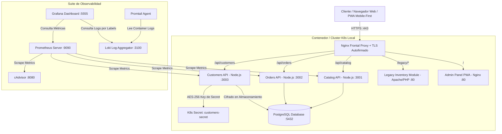
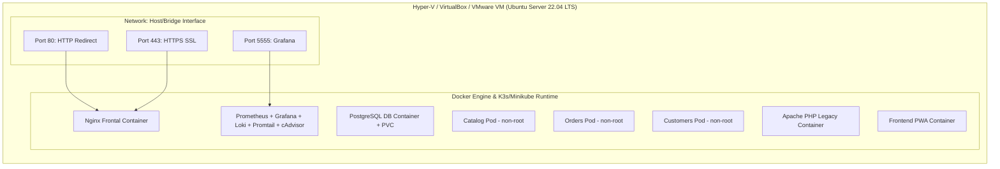

# Arquitectura y Despliegue: Café Boreal S.R.L.

Este documento describe la arquitectura lógica y de infraestructura física/virtual del sistema integrado para **Café Boreal S.R.L.** (Universidad Técnica Nacional - ITI-522 Computación en la Nube).

---

## 1. Diagrama Lógico de la Arquitectura

---

## 2. Diagrama de Despliegue (Infraestructura de VM Única)

---

## 3. Decisiones de Diseño y Trade-Offs

1. **Monolito Legado vs Microservicios Nativos**:
   - *Decisión*: Se mantiene el módulo `/legacy/inventory` aislado en Apache+PHP para respetar el principio de no interferencia con sistemas legados mientras los nuevos microservicios (`catalog`, `orders`, `customers`) se construyen con arquitectura cloud-native no-root en Kubernetes/Docker.
2. **Cifrado en Capa de Aplicación con AES-256-CBC**:
   - *Decisión*: Se utiliza la librería `crypto` estándar de Node.js en `customers-api` para cifrar la cédula/identidad antes de realizar el `INSERT` en PostgreSQL. La clave de 256 bits se inyecta dinámicamente desde un Kubernetes Secret (`customers-secret`). Esto garantiza que ni backups de DB ni consultas `SELECT` directas expongan datos confidenciales sin descifrado en la API/UI.
3. **Observabilidad Ligera (Prometheus + cAdvisor + Loki + Grafana)**:
   - *Decisión*: Se seleccionó Loki en lugar de Elasticsearch debido al bajo consumo de recursos (ideal para la VM única de 12GB RAM) manteniendo filtrado potente por etiquetas (`job`, `pod`, `namespace`).
